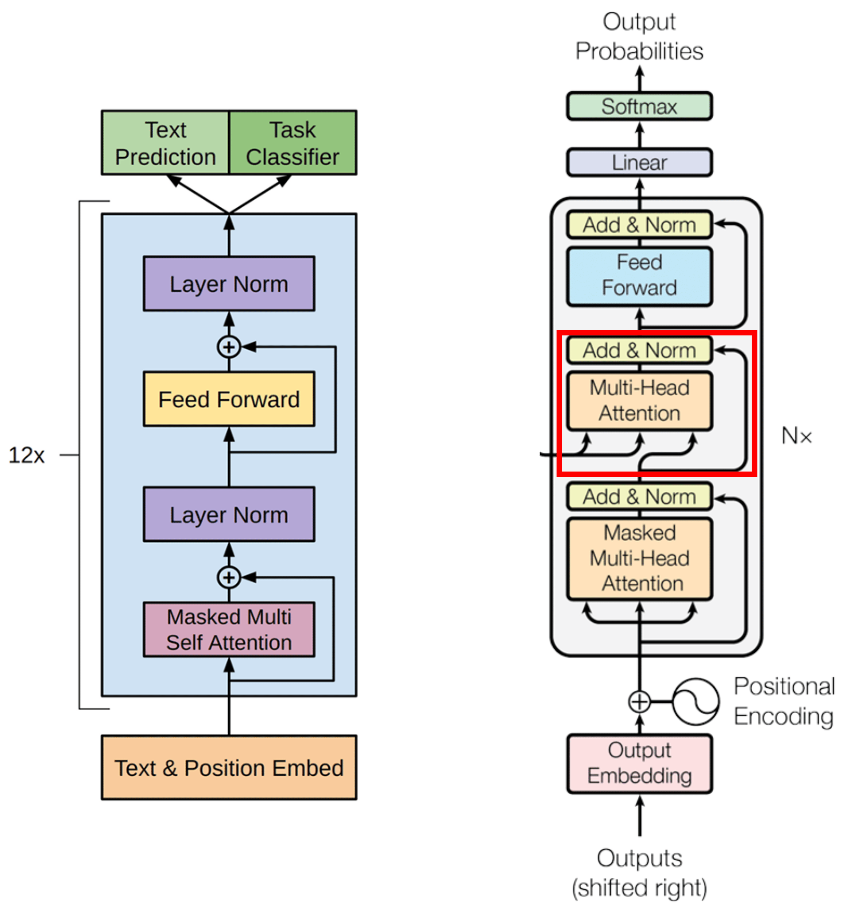

Token IDs
   ↓
Token Embedding
   +
Positional Encoding
   ↓
[N × Decoder Blocks]
   ├─ Masked Self-Attention
   ├─ Add & Norm
   ├─ Feed Forward
   ├─ Add & Norm
   ↓
Linear
   ↓
Softmax
   ↓
Next-token probabilities
